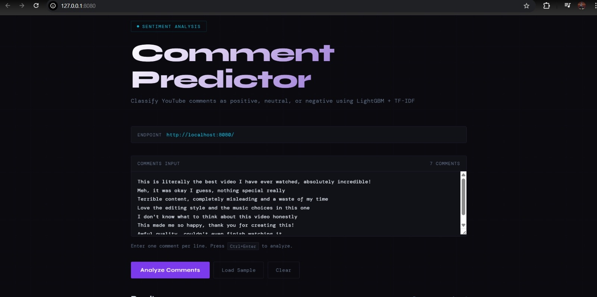
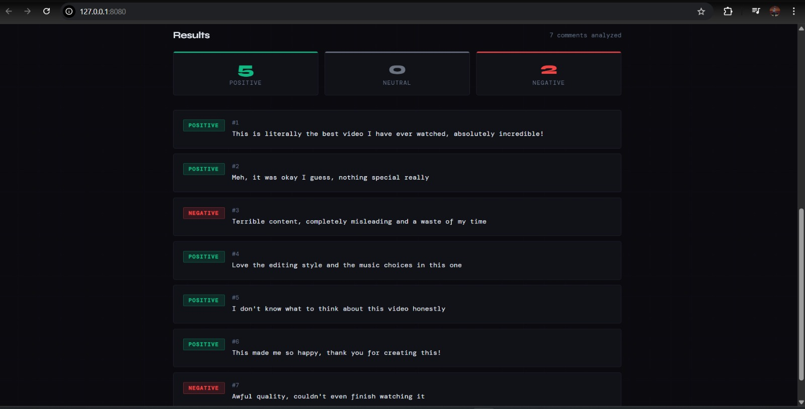

<div align="center">


<br/>

[](https://python.org)
[](https://lightgbm.readthedocs.io)
[](https://mlflow.org)
[](https://dvc.org)
[](https://github.com/features/actions)
[](https://flask.palletsprojects.com)
[](https://docker.com)
[](https://aws.amazon.com)
[](https://github.com/features/actions)
[](LICENSE)

<br/>

> **"Turning 37,249 Youtube comments into production-grade sentiment intelligence — with every experiment tracked, every model versioned, and every deployment automated."**

<br/>
<div align="center">



<br><br>



</div>


</div>

---

## What Is This?

A **production-ready, end-to-end MLOps system** that classifies youtube comments into **Positive**, **Neutral**, or **Negative** sentiment — automatically, at scale.

This isn't just a model. It's a full machine learning system with:

- **5 structured MLflow experiments** comparing vectorizers, classifiers, and sampling strategies
- **Automated hyperparameter tuning** via Optuna (100 trials, Bayesian search)
- **Reproducible DVC pipeline** — from raw data to registered model
- **Dockerized Flask API** deployed automatically via GitHub Actions → AWS ECR → EC2
- **MLflow on AWS** tracking every run, parameter, metric, and artifact

```
37,249 Youtube Comments  →  NLP Pipeline  →  LightGBM (81.3% F1)  →  REST API on AWS
```

---

## Results at a Glance

<div align="center">

| Metric | Score |
|--------|-------|
| Weighted F1-Score | **81.3%** |
| Best Model | **LightGBM** |
| Tuning Method | **Optuna (100 trials)** |
| Feature Space | **10,000 TF-IDF trigrams** |
| Imbalance Handling | **ADASYN** |
| MLflow Experiments | **5 structured groups** |

</div>

---

## AI & ML Techniques

### NLP Preprocessing Pipeline

```
Raw Reddit Text
    │
    ├─ Lowercase + URL removal (regex)
    ├─ Non-ASCII / emoji stripping
    ├─ Lemmatization (spaCy en_core_web_sm)
    ├─ Custom stop-word removal (preserving: not, no, but, however, yet)
    └─ Token filtering (alpha-only, len > 2)
```

### Feature Engineering

| Approach | N-gram Range | Max Features | Result |
|----------|-------------|--------------|--------|
| Bag of Words | (1,1) | 10,000 | Baseline |
| **TF-IDF Trigrams** | **(1,3)** | **10,000** | ✅ **Selected** |

### Class Imbalance — Techniques Compared

| Method | Type | Result |
|--------|------|--------|
| RandomOverSampler | Oversampling | Evaluated |
| SMOTE | Synthetic | Evaluated |
| **ADASYN** | **Adaptive Synthetic** | ✅ **Selected** |
| SMOTETomek | Hybrid | Evaluated |
| SMOTEENN | Hybrid | Evaluated |
| RandomUnderSampler | Undersampling | Evaluated |
| class_weight='balanced' | Classifier-side | Evaluated |

### Model Comparison

| Model | Notes |
|-------|-------|
| Random Forest | Baseline |
| SVM (Linear) | Evaluated |
| XGBoost | Evaluated |
| **LightGBM + Optuna** | ✅ **Winner — 81.3% F1** |
| Stacking (LightGBM + LR) | Evaluated — marginal gain |

### LightGBM — Best Hyperparameters (Optuna, 100 Trials)

```yaml
n_estimators:       886
learning_rate:      0.0628
max_depth:          15
num_leaves:         47
min_child_samples:  14
colsample_bytree:   0.780
subsample:          0.501
reg_alpha (L1):     0.277
reg_lambda (L2):    1.045
```

---

## How It Works

### Architecture Overview

```
┌─────────────────────────────────────────────────────────────────┐
│                         DATA LAYER                              │
│  Reddit CSV (37,249 rows) → DVC-tracked raw data               │
└─────────────────────────┬───────────────────────────────────────┘
                          │
┌─────────────────────────▼───────────────────────────────────────┐
│                      ML PIPELINE (DVC)                          │
│                                                                 │
│  data_ingestion → data_preprocessing → model_building           │
│       → model_evaluation → register_model                       │
│                                                                 │
│  All params from params.yaml  │  All metrics to MLflow          │
└─────────────────────────┬───────────────────────────────────────┘
                          │
┌─────────────────────────▼───────────────────────────────────────┐
│                   MLOPS LAYER (MLflow on AWS)                   │
│                                                                 │
│  Tracking Server: EC2 (port 5000)                               │
│  Artifact Store:  S3 (mlflow-bckt-1)                           │
│  Model Registry:  MLflow Registry                               │
└─────────────────────────┬───────────────────────────────────────┘
                          │
┌─────────────────────────▼───────────────────────────────────────┐
│                    CI/CD (GitHub Actions)                        │
│                                                                 │
│  Push to main → CI (lint + test)                                │
│              → CD (docker build → push to ECR)                  │
│              → Deploy (EC2 pull → run on port 8080)             │
└─────────────────────────────────────────────────────────────────┘
```

---

## MLOps Stack

### MLflow — Experiment Tracking

5 experiments logged to MLflow, running on **AWS EC2** with artifacts stored in **S3**:

| # | Experiment | Purpose |
|---|------------|---------|
| 1 | Random Forest Baseline | BoW vs TF-IDF comparison |
| 2 | TFIDF Trigram max_features | Optimal vocabulary size |
| 3 | Handling Imbalanced Data | 7 sampling strategies |
| 4 | Find Classifier | SVM / RF / XGBoost / LightGBM |
| 5 | Stacking Experiment | Ensemble evaluation |

Every run logs: **params** · **metrics** · **confusion matrix** · **model artifact**

### DVC Pipeline

```yaml
stages:
  data_ingestion:      # → data/raw/
  data_preprocessing:  # → data/processed/   [params: test_size]
  model_building:      # → model/*.pkl        [params: 14 hyperparams]
  model_evaluation:    # → experiment_info.json
  register_model:      # → MLflow Registry
```

### Docker

```dockerfile
FROM python:3.11-slim-bookworm
# LightGBM needs libgomp1 for OpenMP threading
RUN apt-get install -y libgomp1 build-essential
EXPOSE 8080
CMD ["python3", "flask_app/app.py"]
```

### GitHub Actions CI/CD

```
git push main
    │
    ├─ [Job 1] integration        → lint + unit tests  (ubuntu-latest)
    ├─ [Job 2] build-and-push     → docker build → push ECR  (ubuntu-latest)
    └─ [Job 3] deploy             → pull ECR → run on EC2 :8080  (self-hosted)
```

---

## 📁 Project Structure

```
reddit-sentiment-analysis/
│
├── 📂 src/
│   ├── data_ingestion.py       # Download & save raw data
│   ├── data_preprocessing.py  # Clean, lemmatize, split
│   ├── model_building.py      # TF-IDF + ADASYN + LightGBM
│   ├── model_evaluation.py    # Metrics + MLflow logging
│   └── register_model.py      # MLflow Model Registry
│
├── 📂 flask_app/
│   └── app.py                 # REST API (port 8080)
│
├── 📂 data/
│   ├── raw/                   # DVC-tracked raw data
│   └── processed/             # DVC-tracked splits
│
├── 📂 model/
│   ├── lgbm_model.pkl         # Trained LightGBM
│   └── tfidf_vectorizer.pkl   # Fitted vectorizer
│
├── 📂 .github/workflows/
│   └── workflow.yaml          # CI/CD pipeline
│
├── dvc.yaml                   # DVC pipeline definition
├── params.yaml                # All hyperparameters
├── Dockerfile                 # Container definition
└── requirements.txt
```

---

## Quick Start

### Prerequisites

```bash
# Clone the repo
git clone https://github.com/YOUR_USERNAME/reddit-sentiment-analysis.git
cd reddit-sentiment-analysis

# Create virtual environment
python -m venv venv
source venv/bin/activate  # Windows: venv\Scripts\activate

# Install dependencies
pip install -r requirements.txt
```

### Run the DVC Pipeline

```bash
# Initialize DVC
dvc init

# Run the full pipeline
dvc repro

# View pipeline DAG
dvc dag
```

### Configure MLflow (AWS)

```bash
# Set tracking URI
export MLFLOW_TRACKING_URI=http://YOUR_EC2_PUBLIC_DNS:5000/

# Run experiments
python src/model_building.py
```

### Run Locally with Docker

```bash
# Build the image
docker build -t sentiment-api .

# Run the container
docker run -p 8080:8080 sentiment-api

# Test the API
curl -X POST http://localhost:8080/predict \
     -H "Content-Type: application/json" \
     -d '{"comment": "This is absolutely amazing!"}'
```

### Expected Response

```json
{
  "comment": "This is absolutely amazing!",
  "sentiment": "Positive",
  "confidence": 0.94
}
```

---

## GitHub Secrets Required

For CI/CD to work, add these secrets to your GitHub repository:

| Secret | Description |
|--------|-------------|
| `AWS_ACCESS_KEY_ID` | IAM programmatic access key |
| `AWS_SECRET_ACCESS_KEY` | IAM secret key |
| `AWS_REGION` | e.g. `us-east-1` |
| `ECR_REPOSITORY_NAME` | Your ECR repo name |
| `AWS_ECR_LOGIN_URI` | Full ECR registry URI |

---

## AWS Infrastructure Setup

```bash
# 1. Launch EC2 (Ubuntu) — open ports 5000 (MLflow) and 8080 (Flask)

# 2. Install MLflow on EC2
pip install mlflow boto3 awscli
aws configure  # Enter your IAM credentials

# 3. Start MLflow tracking server
mlflow server \
  -h 0.0.0.0 -p 5000 \
  --backend-store-uri sqlite:///mlflow.db \
  --default-artifact-root s3://YOUR_BUCKET_NAME \
  --allowed-hosts "*"

# 4. Set up EC2 as GitHub Actions self-hosted runner
# (Follow GitHub → Settings → Actions → Runners → New self-hosted runner)

# 5. Push to main → GitHub Actions deploys automatically 
```

---

## Key Dependencies

```txt
lightgbm==4.6.0
mlflow==3.10.0
optuna==4.7.0
scikit-learn
imbalanced-learn
spacy
nltk
pandas
numpy
flask
boto3
dvc
```

---

## Contributing

Contributions, issues, and feature requests are welcome!

1. Fork the repository
2. Create your feature branch (`git checkout -b feature/AmazingFeature`)
3. Commit your changes (`git commit -m 'Add some AmazingFeature'`)
4. Push to the branch (`git push origin feature/AmazingFeature`)
5. Open a Pull Request

---

## License

Distributed under the MIT License. See `LICENSE` for more information.

---

<div align="center">


</div>
